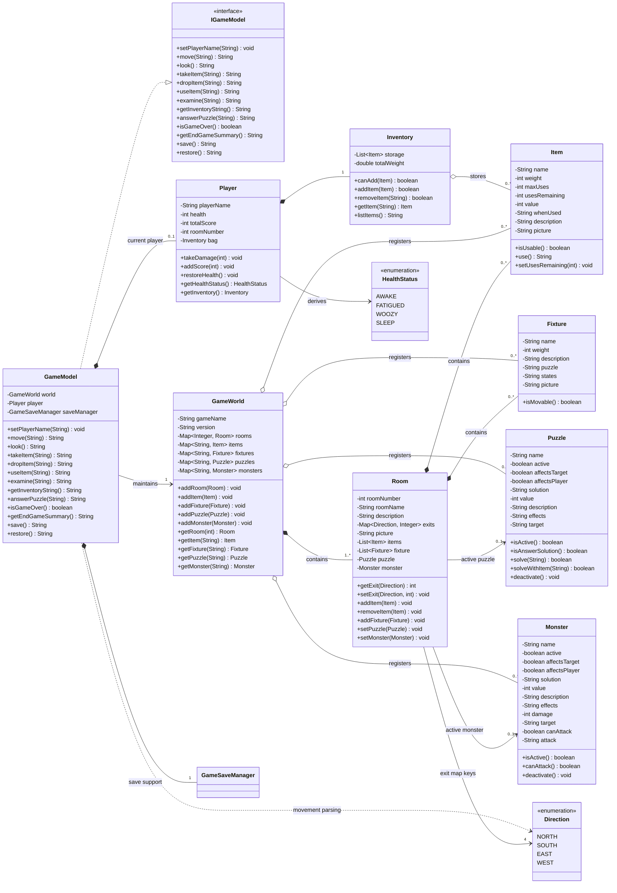
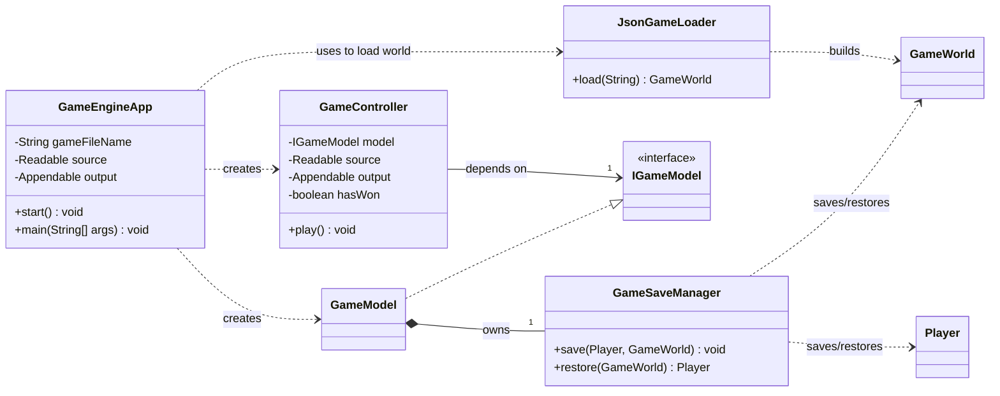
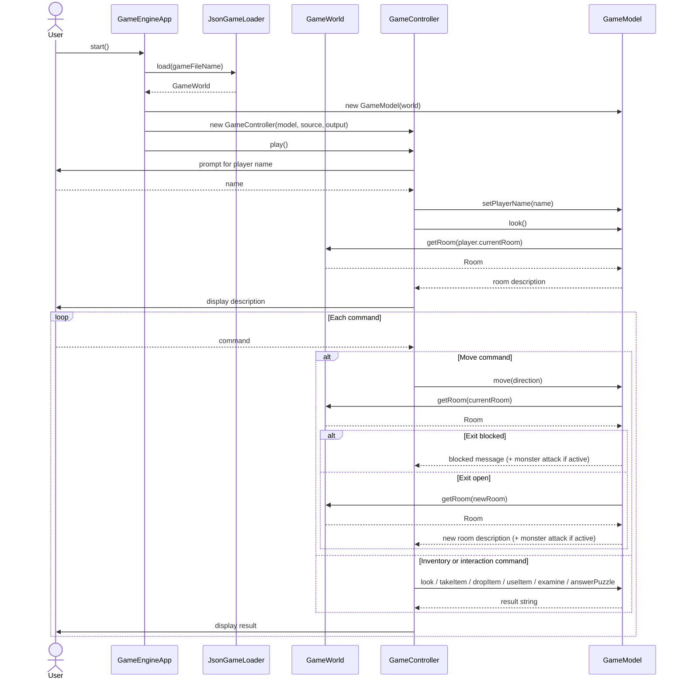
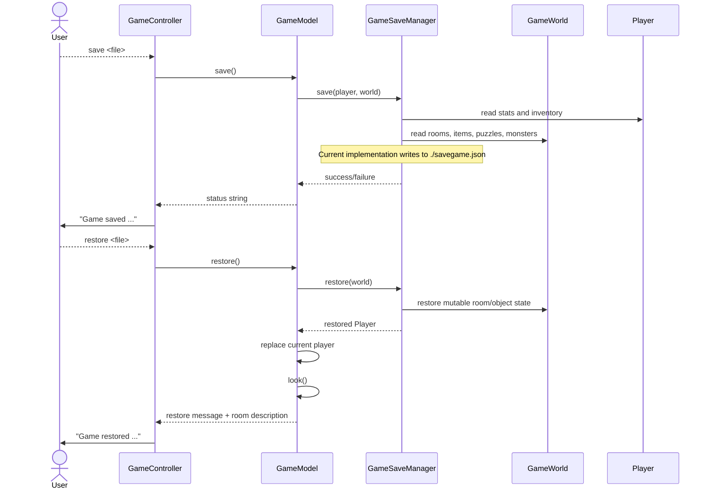

# HW8 UML

This document provides both refined static UML and dynamic UML for the current app.

## 1. Static UML: Domain and Model

## 2. Static UML: App, Controller, Loading, Persistence

## 3. Dynamic UML: Start Game and Normal Command Flow

## 4. Dynamic UML: Save and Restore Flow

## Notes

- The first static diagram focuses on the game domain and model responsibilities.
- The second static diagram focuses on app wiring, controller interaction, loading, and persistence.
- The dynamic diagrams cover the main gameplay path and the save/restore path expected for HW8.
- The save and restore flow currently persists to a fixed file path, `./savegame.json`, even though the controller reads a file-name argument from the user.
